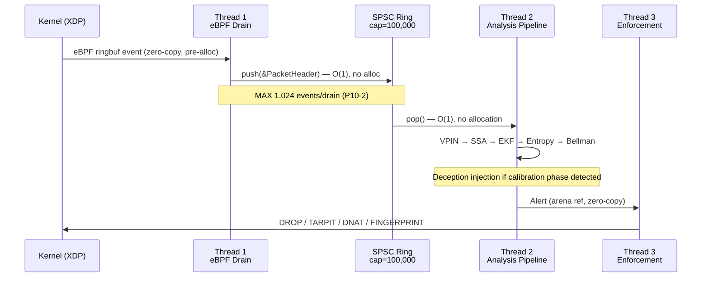

# SHIFTING GHOST

<div align="center">

```
╔══════════════════════════════════════════════════════════════════════════════╗
║  SOVEREIGN ACTIVE DEFENSE FRAMEWORK                                          ║
║  Cyber-Deception  ×  Adversarial Attrition  ×  Kinetic Cost Asymmetry       ║
╚══════════════════════════════════════════════════════════════════════════════╝
```

[](/)
[](/)
[](/)
[](/)
[](/)
[](/)

**Taha Kouiyasse** — Lead Systems Architect & Founder  
*Independent Researcher in Augmented Engineering*

</div>

---

## The Doctrine

> *Most intrusion detection systems ask: "Is this an attack?"*  
> *SHIFTING GHOST asks: "How do we make the attacker destroy themselves?"*

SHIFTING GHOST is not an Intrusion Detection System.

It is a **Sovereign Active Defense Framework** — a mathematically grounded, zero-allocation, eBPF-native engine designed not merely to detect adversarial traffic, but to **systematically degrade the operational capacity of an attacker** through deterministic deception, controlled entropy injection, and asymmetric resource exhaustion.

The core thesis is simple and brutal:

> **Detection without attrition is surveillance. Attrition without deception is a firewall. SHIFTING GHOST is neither.**

An attacker who reaches this system does not encounter a wall. They encounter a **mirror** — carefully calibrated to reflect their own signatures back at them, corrupt their reconnaissance models, and burn their operational resources against hardened phantoms until they are operationally insolvent.

This architecture is built for one class of operator: **sovereigns who cannot afford to lose**.

---

## White Papers

| # | Title | Audience | Status |
|---|-------|----------|--------|
| **WP-01** | [Technical Architecture — Rust, eBPF/XDP, NASA P10, Zero-Allocation Substrate](./docs/White_Paper_Critical_Infrastructures.pdf) | Lead Engineers, Heads of Engineering | ✅ Published |
| **WP-02** | [Strategic Doctrine — Adversarial Poisoning, SSA/Kalman Deception, Kinetic Atrophy](./docs/White_Paper_Critical_Infrastructures_t.pdf) | CISO, Cyber-Defence Strategists, CTO | ✅ Published |

> Both papers are authoritative specifications. WP-01 defines the engineering contract. WP-02 defines the operational philosophy. Neither is optional reading for anyone deploying this system.

---

## Technical Pillars

### I. Zero-Allocation, Post-Init Invariant

After `Arena::lock()` is called at startup, SHIFTING GHOST **allocates nothing**. Not a byte. Every data structure — packet headers, flow scores, alert objects, ring buffer slots — lives in a pre-committed 256 MB linear arena, subdivided into compile-time-bounded pools.

This is not a performance optimisation. It is a **security invariant**: heap fragmentation is an attack surface. A system that cannot be surprised by its own allocator cannot be destabilised by allocation-pattern side channels.

```
INVARIANT-A  Arena::lock() called before Thread 1 starts.
             After lock: zero Box::new, zero Vec::push, zero heap.

INVARIANT-B  All ring buffers have compile-time capacity constants.
             RING_PACKET_CAPACITY = 100,000
             SPSC_CAPACITY        = 1,024

INVARIANT-C  Every inter-thread channel carries a named bounded capacity.
             CHAN_T1_T2 = 128 · CHAN_T2_T3 = 256

INVARIANT-D  The eBPF ringbuf is the sole kernel→userspace data path.
             No mmap outside Aya. No shared heap.
```

### II. eBPF/XDP — Native Mode, Driver Level

Packet ingestion occurs at the **XDP driver hook** — before the Linux networking stack allocates a socket buffer, before `sk_buff` construction, before any kernel processing. This is not SKB mode. This is not generic mode. This is the zero-copy path.

```
[NIC Driver] → [XDP Hook: packet_ingress.bpf.o] → [eBPF Ringbuf] → [Userspace Arena]
```

The consequence: at no point does SHIFTING GHOST's analysis pipeline compete with kernel networking overhead. The detection latency is bounded by physics, not software.

### III. NASA Power of Ten Compliance

SHIFTING GHOST enforces the full NASA JPL Power of Ten ruleset as **compile-time constraints**, not style guidelines.

| Rule | Constraint | Mechanism |
|------|------------|-----------|
| P10-1 | No dynamic allocation after init | `Arena::lock()` typestate — compile error if violated |
| P10-2 | All loops have fixed upper bounds | `#![deny(clippy::infinite_iter)]` + CI gate |
| P10-4 | No function > 60 lines | `clippy::too_many_lines` — workspace-wide |
| P10-5 | All error paths encoded in return type | `#[must_use]` on every `Result<>` |
| P10-7 | No recursion | `#![deny(clippy::recursive)]` |
| P10-8 | No pointer aliasing violations | `#![forbid(unsafe_code)]` on 17 of 18 crates |
| P10-10 | Warnings = errors | `#![deny(warnings)]` workspace-wide |

> `sg-arena` is the single crate with `unsafe_code = "allow"`. Every `unsafe` block carries a mandatory `// SAFETY:` invariant proof embedded in source.

### IV. The Detection Engine

Anomalous structured events embedded in high-entropy noise are the common signature of both coordinated network intrusion and informed adversarial behaviour. The detection substrate is built on five interlocking primitives:

| Primitive | Function | Threshold |
|-----------|----------|-----------|
| **Extended Kalman Filter** | Packet-rate outlier detection | σ = 2.7 corridor |
| **Bellman Optimisation** | Composite threat score gate | Top 5% percentile |
| **Singular Spectrum Analysis** | Traffic regime shift detection | Δσ₁ > 0.15 |
| **Dual Entropy (Shannon + Rényi)** | Encrypted exfiltration classifier | H_s > 0.95 |
| **VPIN** | Informed packet-flow probability | Threshold 0.72 |

These are not heuristics. They are **closed-form mathematical operators** with deterministic output on bounded inputs, verifiable under formal proof, and auditable at every pipeline stage.

---

## Strategic Doctrine (White Paper No. 2)

> *"The highest victory is not to destroy the enemy's forces. It is to destroy their confidence in their own instruments."*

WP-02 formalises three strategic mechanisms that distinguish SHIFTING GHOST from passive detection infrastructure. These are **offensive-in-posture, defensive-in-mandate** techniques — legally and ethically constrained to sovereign infrastructure defense. See the [Legal Disclaimer](#legal--ethical-disclaimer) below.

### Pillar I — Deterministic Gaslighting

**Mechanism:** SSA + Kalman Filter Adversarial Poisoning

An attacker conducting reconnaissance calibrates their models against observed traffic. SHIFTING GHOST detects this calibration phase via VPIN-informed flow analysis, then **injects structured synthetic traffic** designed to be indistinguishable from legitimate flows at the entropy level, while carrying false regime signals in the SSA decomposition.

The result: the attacker's own EKF diverges. Their anomaly thresholds drift. Their confidence intervals widen. By the time they escalate to active intrusion, their operational model of the target network is **systematically incorrect**.

They are not attacking the network. They are attacking a mathematical phantom we have placed in front of it.

### Pillar II — Kinetic Cost Asymmetry

**Mechanism:** Asymmetric Resource Exhaustion

Every packet SHIFTING GHOST processes costs the defender near-zero (zero-allocation pipeline, sub-microsecond enforcement). Every engagement we initiate against an attacker — tarpit sessions, fabricated handshake cycles, synthetic protocol exchanges — costs the attacker **wall-clock time, CPU cycles, operator attention, and toolchain state**.

The arithmetic is not subtle:

- **Defender cost per attacker probe:** O(1) arena slot, bounded SPSC push, single EKF update.
- **Attacker cost per ghost engagement:** Full TCP session establishment, reconnaissance tool execution, result logging, model update, analyst review.

At scale, the asymmetry becomes a **force multiplier**. A single SHIFTING GHOST node can operationally saturate a coordinated attack team's cognitive bandwidth without ever exposing the protected surface.

### Pillar III — Operational Atrophy

**Mechanism:** Tar-pitting, Entropy Sentinel, Honeypot DNAT

The third pillar is the endgame. Where Pillars I and II corrupt the attacker's models and exhaust their resources, Pillar III **destroys their operational tempo**.

- **TCP Window-Zero Tar-pit (`sg-tarpit`):** Legitimate-appearing sessions that freeze indefinitely via window advertisement manipulation. The attacker's toolchain stalls. Their timeout counters run. Their scan queues fill. They cannot distinguish stall from success.
- **Entropy Sentinel (`sg-entropy`):** Any flow with Shannon entropy H_s > 0.95 (characteristic of encrypted command channels and exfiltration payloads) is flagged, scored, and subjected to selective injection of synthetic entropy noise — degrading their channel's signal-to-noise ratio without triggering obvious detection.
- **Honeypot DNAT (`sg-honeypot`):** High-confidence threats (Bellman score: top 5%) are transparently redirected via DNAT to isolated deception containers. The attacker believes they have achieved lateral movement. They have achieved isolation. Everything they do inside the honeypot is logged, fingerprinted, and fed back into the detection model as training signal.

The attacker who persists long enough reaches a state of **operational atrophy**: their tools are stalling, their models are corrupted, their sessions are phantoms, and their every action is being weaponised as intelligence against them.

---

## Architecture

### Crate Structure

```
shifting-ghost/
│
├── core/                          # Shared substrate
│   ├── sg-types/                  # ✅ ABI contracts — all crates depend on this
│   ├── sg-arena/                  # ✅ 256 MB linear arena, SPSC ring, object pool
│   └── sg-ebpf/                   # ✅ eBPF/XDP loader, BPF map API
│
├── cyber/                         # Active defense pipeline
│   ├── sg-capture/                # AF_PACKET ingestion, VPIN gate, flood detection
│   ├── sg-window/                 # Windowed packet history
│   ├── sg-ssa/                    # SSA regime shift detector
│   ├── sg-entropy/                # Dual entropy classifier (Shannon + Rényi)
│   ├── sg-ekf/                    # Adaptive Extended Kalman Filter
│   ├── sg-persistence/            # Hurst exponent + Z-score scoring
│   ├── sg-bellman/                # Composite Bellman threat scorer
│   ├── sg-tarpit/                 # TCP Window-Zero + tc netem jitter
│   ├── sg-honeypot/               # DNAT deception container routing
│   ├── sg-nftables/               # nftables JSON enforcement API
│   ├── sg-fingerprint/            # eBPF TCP header spoof / obfuscation
│   ├── sg-threads/                # Thread orchestration + hardware watchdog
│   ├── sg-governance/             # Calibration controller
│   ├── sg-runtime/                # Binary entry point
│   └── sg-siem/                   # TLS SIEM forwarder + Prometheus exporter
│
└── docs/
    ├── White_Paper_Technical_Architecture.pdf
    └── White_Paper_Strategic_Doctrine.pdf
```

### Pipeline — Threat Lifecycle



---

## Proof of Validation

### Core Substrate — 13/13 Tests

```
$ sudo -E cargo test -p sg-ebpf -- --nocapture

running 13 tests
test test_cap_bpf_absent_clean_error        ... ok
test test_cap_all_present_returns_ok        ... ok
test test_cap_check_io_failure              ... ok
test test_cap_net_admin_absent_clean_error  ... ok
test test_drain_events_bounded_by_max       ... ok
test test_fp_params_default_is_inert        ... ok
test test_fp_params_size                    ... ok
test test_ebpf_event_default_is_zero        ... ok
test test_loader_all_degraded_none_attached ... ok
test test_loader_degraded_mode              ... ok
test test_ready_flag_signal_and_clear       ... ok
test test_ringbuf_drain_bounded_returns_empty_slice ... ok
test test_ebpf_probes_load                  ... ignored (requires root)

test result: ok. 12 passed; 0 failed; 1 ignored
```

### eBPF/XDP — Native Mode Attachment (Debian 13, root)

```
$ sudo -E cargo test -p sg-ebpf test_ebpf_probes_load -- --ignored --nocapture

running 1 test
[sg-ebpf] XDP 'packet_ingress' attached (native) to 'lo'
test test_ebpf_probes_load ... ok

test result: ok. 1 passed; 0 failed; 0 ignored — finished in 0.72s
```

> **Native XDP mode** — not generic (SKB), not offload. The probe executes at the driver level, before the kernel networking stack allocates any socket buffer. This is the zero-copy path mandated by INVARIANT-D.

---

## Augmented Engineering Methodology

> *"A human architect maintains exclusive authority over system design — memory layout, inter-module contracts, invariant specification, and quality gates — while delegating code generation to AI agents operating under those contracts.*
>
> *The quality guarantee is architectural, not editorial."*

Every crate in this ecosystem was produced by AI agents operating under formal trait interfaces, memory layout specifications, and compile-time invariants enforced by the Rust type system. The architect directed. The agents produced. The type system enforced.

This methodology — **Augmented Engineering** — is not a shortcut. It is a force multiplier applied to a domain where the cost of a single invariant violation is measured in compromised infrastructure, not in debugging hours. The contracts are the product. The code is a consequence.

---

## Legal & Ethical Disclaimer

```
╔══════════════════════════════════════════════════════════════════════════════╗
║  SOVEREIGN USE ONLY — READ BEFORE DEPLOYMENT                                 ║
╚══════════════════════════════════════════════════════════════════════════════╝
```

SHIFTING GHOST is developed exclusively as a **defensive framework for the protection of sovereign and authorised infrastructure**. The techniques described in this repository — including adversarial traffic poisoning, deceptive session fabrication, entropy injection, and honeypot redirection — are designed and intended solely for deployment on networks and systems **owned or explicitly authorised** by the operating entity.

**Deployment of this system against any network, system, or infrastructure for which the operator does not hold explicit legal authorisation constitutes a criminal offence under applicable computer crime legislation**, including but not limited to:

- The Computer Fraud and Abuse Act (CFAA), 18 U.S.C. § 1030 (United States)
- The Computer Misuse Act 1990 (United Kingdom)
- Directive 2013/40/EU on attacks against information systems (European Union)
- Equivalent national legislation in all other jurisdictions

The author assumes no liability for misuse. There are no legitimate grey areas. Offensive deployment without authorisation is not a configuration error — it is a crime.

This project is published for the advancement of sovereign cyber-defense capability, academic research in adversarial system design, and the education of engineers operating at the intersection of mathematical signal processing and network security.

**If you are not authorised to deploy active defense mechanisms on your target network, you are not the intended operator of this system.**

---

<div align="center">

**SHIFTING GHOST** — Sovereign Active Defense Framework  
*Built under NASA P10 · Zero-Allocation Post-Init · eBPF Native · Rust 2021*

**Taha Kouiyasse**  
Lead Systems Architect & Founder  
Independent Researcher in Augmented Engineering

*"The attacker who cannot trust their own instruments has already lost."*

</div>
