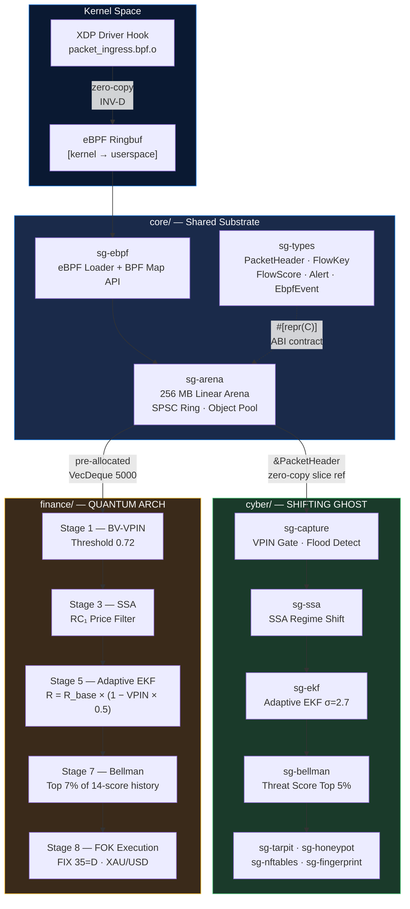
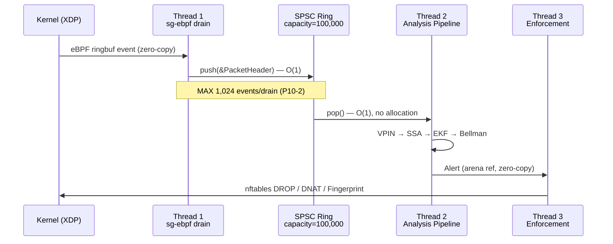

# SHIVA PROTOCOL

<div align="center">

```
╔══════════════════════════════════════════════════════════════════╗
║  SOVEREIGN CRITICAL INFRASTRUCTURE — AUGMENTED ENGINEERING       ║
║  Cyber-Defence × High-Frequency Trading × Unified Architecture   ║
╚══════════════════════════════════════════════════════════════════╝
```

[](/)
[](/)
[](/)
[](/)
[](/)
[](/)

**Taha Kouiyasse** — Lead Systems Architect & Founder  
*Independent Researcher in Augmented Engineering*

</div>

---

## 📄 White Paper

> **[Mission-Critical Architectures: Convergence of Cyber-Defence and HFT via Augmented Engineering](./docs/White_Paper_Critical_Infrastructures.pdf)**  
> Full technical specification — mathematical substrate, architecture contracts, proof of execution.  
> *Audience: Lead Engineers and Heads of Engineering at defence-technology and quantitative finance organisations.*

---

## Abstract

**SHIVA PROTOCOL** is a unified ecosystem of mission-critical systems built on a single
architectural substrate. The name reflects the duality at the core of the design: destruction
(*Cyber-Defence — SHIFTING GHOST*) and creation-through-order (*High-Frequency Trading —
THE QUANTUM ARCH*).

Both systems are operationally distinct. Both are mathematically identical.

A network under coordinated attack and a gold market under informed trading produce the
same signal signature: **anomalous structured events embedded in high-entropy noise**.
The detection engine is the same. The memory model is the same. The enforcement latency
guarantee is the same.

| Primitive | SHIFTING GHOST | THE QUANTUM ARCH |
|---|---|---|
| **Extended Kalman Filter** | Packet-rate outlier detection, σ=2.7 corridor | Price dislocation tracker, adaptive R via VPIN |
| **Bellman Optimisation** | Threat score percentile gate (top 5%) | Signal quality gate (top 7% of 14-score history) |
| **Singular Spectrum Analysis** | Traffic regime shift via Δσ₁ > 0.15 | XAU/USD trend extraction, RC₁ diagonal averaging |
| **Dual Entropy (Shannon + Rényi)** | Encrypted exfiltration detection, H_s > 0.95 | Market chaos classifier, H_s < 0.85 gate |
| **VPIN** | Informed-packet-flow probability | Smart Money detection, threshold 0.72 |

The shared core — `18 Rust crates`, `256 MB arena allocator`, `NASA Power of 10 compliance`
— is not an abstraction. It is a deployed, tested, hardware-verified substrate.

---

## Repository Structure

```
shiva-protocol/
│
├── core/                          # Shared substrate — the universal engine
│   ├── sg-types/                  # ✅ VALIDATED — ABI contracts, all 18 crates depend on this
│   ├── sg-arena/                  # ✅ VALIDATED — 256 MB arena, SPSC ring, object pool
│   └── sg-ebpf/                   # ✅ VALIDATED — eBPF/XDP loader, BPF map API
│
├── cyber/                         # SHIFTING GHOST — Sovereign IDS
│   ├── sg-capture/                # Phase 2 — AF_PACKET ingestion, VPIN, flood detection
│   ├── sg-window/                 # Phase 2 — Windowed packet history
│   ├── sg-ssa/                    # Phase 2 — SSA anomaly detector
│   ├── sg-entropy/                # Phase 2 — Dual entropy classifier
│   ├── sg-ekf/                    # Phase 2 — Adaptive EKF
│   ├── sg-persistence/            # Phase 2 — Hurst + Z-score scoring
│   ├── sg-bellman/                # Phase 2 — Composite Bellman scorer
│   ├── sg-tarpit/                 # Phase 3 — TCP Window-Zero + tc netem jitter
│   ├── sg-honeypot/               # Phase 3 — DNAT deception container
│   ├── sg-nftables/               # Phase 3 — nftables JSON API
│   ├── sg-fingerprint/            # Phase 3 — eBPF TCP header spoof
│   ├── sg-threads/                # Phase 4 — Thread orchestration + watchdog
│   ├── sg-governance/             # Phase 4 — Calibration controller
│   ├── sg-runtime/                # Phase 4 — Binary entry point
│   └── sg-siem/                   # Phase 5 — TLS SIEM forwarder + Prometheus
│
├── finance/                       # THE QUANTUM ARCH v2.2 — XAU/USD HFT
│   └── quantum-arch/              # ✅ OPERATIONAL — 8-stage pipeline, FIX protocol
│
├── docs/
│   └── whitepaper_convergence.pdf # Technical White Paper (full specification)
│
└── Cargo.toml                     # Workspace root — resolver = "2"
```

---

## Architecture

### Shared Memory Model



### Inter-Thread Data Flow — SHIFTING GHOST



---

## Invariants (Non-Negotiable)

```
INVARIANT-A  Arena::lock() called before Thread 1 starts.
             After lock: zero Box::new, zero Vec::push, zero heap.

INVARIANT-B  All ring buffers have compile-time capacity constants.
             RING_PACKET_CAPACITY = 100_000  (sg-arena)
             SPSC_CAPACITY        = 1_024    (quantum-arch)

INVARIANT-C  Every inter-thread channel has a named bounded capacity.
             CHAN_T1_T2 = 128 · CHAN_T2_T3 = 256

INVARIANT-D  The eBPF ringbuf is the sole kernel→userspace data path.
             No mmap outside Aya. No shared heap.
```

---

## Proof of Validation

### Core Substrate — 13/13 Tests

```
$ sudo -E cargo test -p sg-ebpf -- --nocapture

running 13 tests
test test_cap_bpf_absent_clean_error        ... ok
test test_cap_all_present_returns_ok        ... ok
test test_cap_check_io_failure              ... ok
test test_cap_net_admin_absent_clean_error  ... ok
test test_drain_events_bounded_by_max       ... ok
test test_fp_params_default_is_inert        ... ok
test test_fp_params_size                    ... ok
test test_ebpf_event_default_is_zero        ... ok
test test_loader_all_degraded_none_attached ... ok
test test_loader_degraded_mode              ... ok
test test_ready_flag_signal_and_clear       ... ok
test test_ringbuf_drain_bounded_returns_empty_slice ... ok
test test_ebpf_probes_load                  ... ignored (requires root)

test result: ok. 12 passed; 0 failed; 1 ignored
```

### eBPF/XDP — Native Mode Attachment (Debian 13, root)

```
$ sudo -E cargo test -p sg-ebpf test_ebpf_probes_load -- --ignored --nocapture

running 1 test
[sg-ebpf] XDP 'packet_ingress' attached (native) to 'lo'
test test_ebpf_probes_load ... ok

test result: ok. 1 passed; 0 failed; 0 ignored — finished in 0.72s
```

> **Native XDP mode** — not generic (SKB), not offload. The probe executes at the driver
> level, before the kernel networking stack allocates any socket buffer. This is the
> zero-copy path mandated by INVARIANT-D.

### THE QUANTUM ARCH — Live XAU/USD Session

```
# Live execution logs — Monday session (FIX feed, Tier-1 LP)
# [PLACEHOLDER — to be populated from live session]
```

---

## NASA Power of 10 Compliance

| Rule | Constraint | Enforcement Mechanism |
|------|------------|----------------------|
| P10-1 | No dynamic allocation after init | `Arena::lock()` typestate — compile error if violated |
| P10-2 | All loops have fixed upper bounds | `#![deny(clippy::infinite_iter)]` + CI gate |
| P10-4 | No function > 60 lines | `clippy::too_many_lines` — workspace-wide |
| P10-5 | All error paths encoded in return type | `#[must_use]` on every `Result<>` |
| P10-7 | No recursion | `#![deny(clippy::recursive)]` |
| P10-8 | No pointer aliasing violations | `#![forbid(unsafe_code)]` on 17 of 18 crates |
| P10-10 | Warnings = errors | `#![deny(warnings)]` workspace-wide |

> `sg-arena` is the single crate with `unsafe_code = "allow"`.
> Every `unsafe` block carries a mandatory `// SAFETY:` invariant proof.

---

## Generalization Horizon

The mathematical substrate of SHIVA PROTOCOL is domain-agnostic.
These are not future directions. They are direct instantiations of the existing codebase.

| Domain | Component | Transfer |
|--------|-----------|----------|
| **Radar Target Tracking** | EKF PVA | `[p,v,a]` → `[range, ṙ, r̈]`. Same 2.7σ gate. Same SPSC ring at PRF rates. |
| **Satellite Telemetry** | SSA + Hurst | σ₁ slope criterion detects orbital drift. Bellman percentile gates alert severity. |
| **SIGINT Classification** | Dual Entropy | H_s > 0.95 on RF signal → spread-spectrum or frequency-hopped. 32-bin L1-resident operator. |
| **Autonomous Systems** | Full architecture | 3-thread + kill switch + zero post-init alloc = DO-178C Level A structural pattern. |

---

## Augmented Engineering

> *"A human architect maintains exclusive authority over system design — memory layout,
> inter-module contracts, invariant specification, and quality gates — while delegating
> code generation to AI agents operating under those contracts.*
>
> *The quality guarantee is architectural, not editorial."*

Every crate in this ecosystem was generated by AI agents supplied with formal trait
interfaces, memory layout specifications, and compile-time invariants enforced by the
Rust type system. The author directed. The agents produced. The type system enforced.

This methodology is reproducible, auditable, and faster than any team of manual engineers
operating without formal architectural contracts.

---

<div align="center">

**SHIVA PROTOCOL** — Sovereign Technology  
*Built under NASA P10 · Zero-Allocation · eBPF Native · Rust 2021*

**Taha Kouiyasse**  
Lead Systems Architect & Founder  
Independent Researcher in Augmented Engineering

</div>

